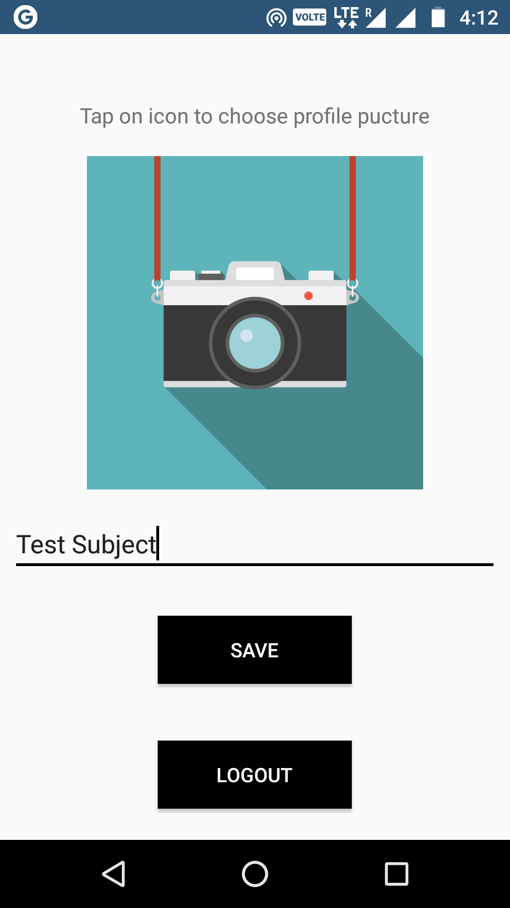

# Firebase_Authentication
Firebase Authentication code for an Android application.

The given code is to be used as a tutorial for Firebase Authentication, necessary comments have been provided.

# Prerequisites

- Supported Android 4.0.1 or above
- Android Studio 3.0.0 or higher
- Firebase Integration required

For Firebase integration into the app, head to the Tools menu, click on Firebase, from the menu that popups, choose Authentication and
press on "Connect"

# Screenshots

&emsp;&emsp;
&emsp;&emsp;

